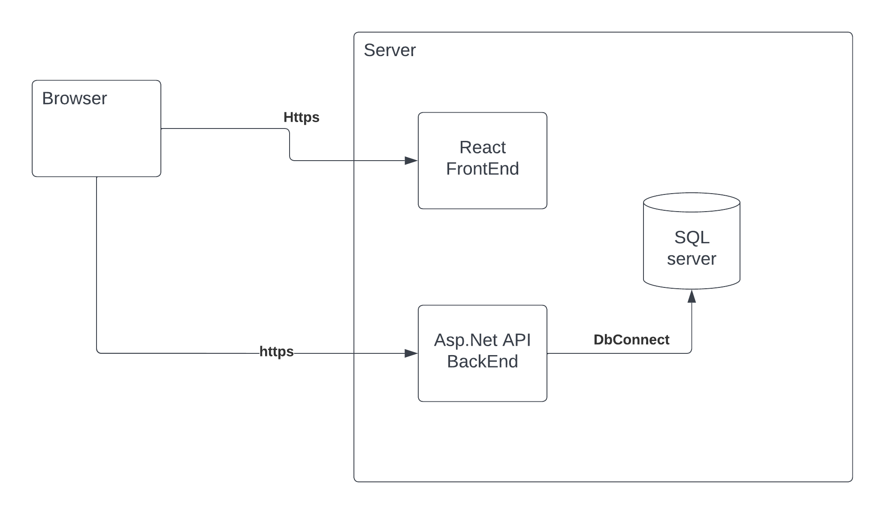
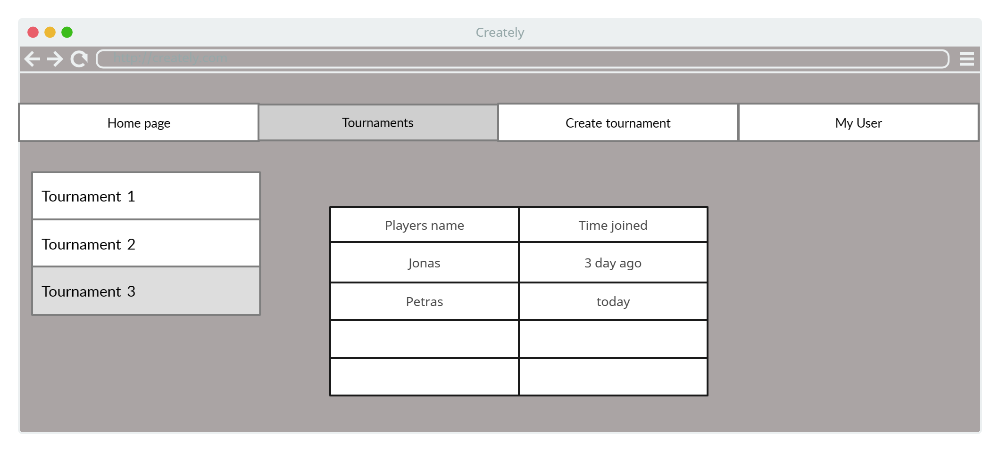
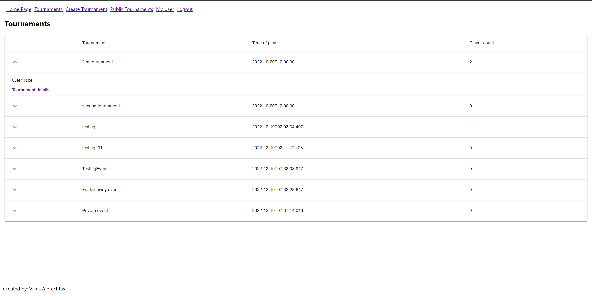
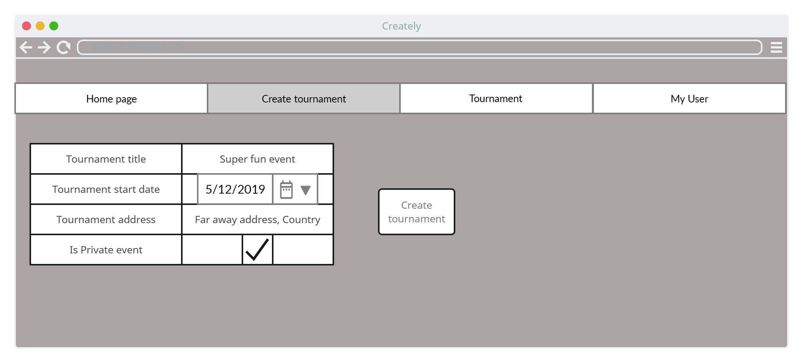
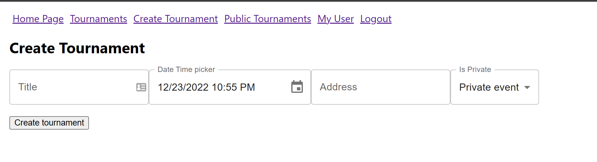
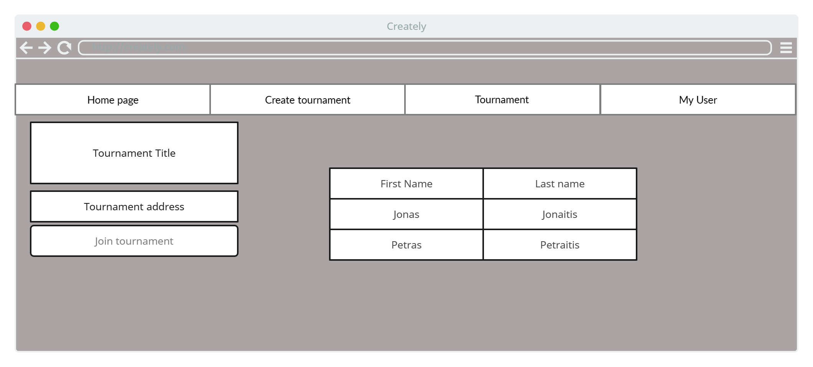
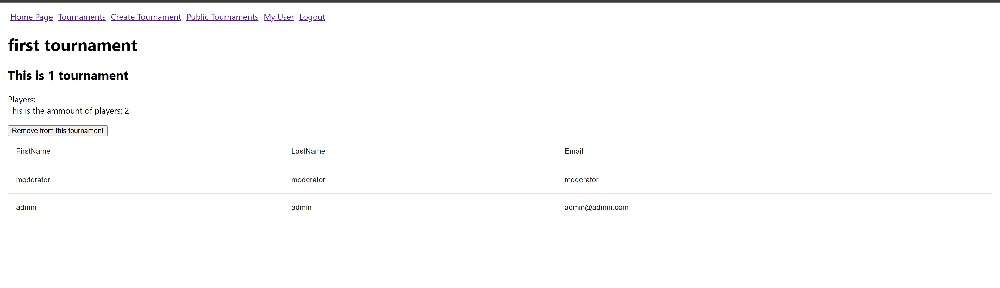

# T120B165 Saityno taikomųjų programų projektavimas

T120B165 Saityno taikomųjų programų projektavimas - projektas

## Projektas: Turnyrų valdymo sistema "Competio"

**Sistemos paskirtis**: Palenginvti renginių organizatoriams vesti turnyrus tarp dalyvių ir paprastai sekti rezultatus

**API metodai**:

- Kurti/skaityti/keisti/trinti žaidimų sukūrimas ir rezultatai
- Kurti/keisti/trinti/peržiūrėti turnyrus, jų žaidėjus ir žaidimus
- Kurti/keisti/trinti/peržiūrėti vartotojus

Turnyras susideda iš žaidimų ir žaidėjų.
Žaidimai susideda iš žaidimo raundų
Žaidimo raundai susideda iš žaidėjų.

**Rolės**: svečias (neprisijungęs naudotojas), žaidėjas, moderatorius, administratorius

## Funkciniai reikalavimai:

Neregistruotas sistemos naudotojas galės:

- Peržiūrėti platformos reprezentacinį puslapį;
- Prisijungti prie internetinės aplikacijos.
- Atsidaryti viešai prieinama turnyra ir stebėti turnyro informacija
- Pateikti užklausa dėl naujo turnyro organizavimo

Registruotas sistemos naudotojas galės:

- Atsijungti nuo internetinės aplikacijos;
- Prisijungti (užsiregistruoti) prie platformos;
- Dalyvaujamuose turnyruose peržiūra
- Peržiūrėti/Redaguoti naudotojo informacija

Administratorius galės:

- Sukurti viešą arba privatų turnyrą
- Prie turnyro priskirti žaidimus/rungtis kurios vyks jo metu
- Nustatyti žaidimo taškų skaičiavimo logikos algoritmą
- Nustatyti žaidimo dalyvius
- Redaguoti žaidimo rezultatus
- Paskelbti žaidimą užbaigtą
- Paskirti naujus vartotojus administratoriais
- Šalinti naudotojus

## Sistemos architektūra:

UML deployment diagram :


**Pasirinktos technologijos:**

- Frontend dalis: React
- Backend dalis: C# Core ASP.Net + MySQL Server

## Wireframes/Svetainė

- /tournaments

Wireframe:


Actual:


- /create-tournament

Wireframe:


Actual:


- /tournament/{id}

Wireframe:


Actual:


## API specifikacija

### Turnyro CRUD

<table>
<tr> <td> <b> Gauti turnyrus </b> </td> <td> </td></tr> 
<tr> <td> API metodas </td> <td> GET </td></tr>  
<tr> <td> Kelias iki metodo </td> <td> /api/Tournament </td></tr>  
<tr> <td> Vartotojai, galintys pasiekti </td> <td> player,moderator,administrator </td></tr>  
<tr> <td> Paskirtis </td> <td> Gauti visus turnyrus  </td></tr>  
<tr> <td> Užklausos "Header" dalis </td> <td> „Authorization“:“ Bearer {access_token}" </td></tr> 
<tr> <td> Užklausos struktūra </td> <td> - </td></tr>  
<tr> <td> Atsakymo struktūra </td> <td>

```json
[
  {
    "id": 0,
    "status": 0,
    "dateCreated": "2022-12-18T14:03:11.310Z",
    "dateEditted": "2022-12-18T14:03:11.310Z",
    "total": 0,
    "subtotal": 0
  }
]
```

</td></tr>  
<tr> <td> Atsakymo kodas</td> <td> 200 (OK) </td></tr> 
<tr> <td> Galimi klaidų kodai </td> <td> 401 - neautorizuotas </td></tr> 
<tr> <td> Užklausos pavyzdys </td> <td>https://saitynaitournamentapi.azurewebsites.net/api/Tournament </td></tr> 
<tr> <td> Gauto atsakymo pavyzdys </td> <td>

```json
[
  {
    "pkTournamentId": 1,
    "title": "Title",
    "startsAt": "2022-12-23T16:01:08.035Z",
    "address": "string",
    "isPrivate": true,
    "tournamentReferee": 2
  }
]
```

</td></tr>
</table>

<table>
<tr> <td> <b> Gauti turnyra </b> </td> <td> </td></tr> 
<tr> <td> API metodas </td> <td> GET </td></tr>  
<tr> <td> Kelias iki metodo </td> <td> /api/Tournament/{id} </td></tr>  
<tr> <td> Vartotojai, galintys pasiekti </td> <td> Žaidėjas, Admin, Moderatorius </td></tr>  
<tr> <td> Paskirtis </td> <td> Gauti konkretų turnyrą  </td></tr>  
<tr> <td> Užklausos "Header" dalis </td> <td> „Authorization“:“ Bearer {access_token}" </td></tr> 
<tr> <td> Užklausos struktūra </td> <td> - </td></tr>  
<tr> <td> Atsakymo struktūra </td> <td>

```json
{
  "pkTournamentId": 0,
  "title": "string",
  "startsAt": "2022-12-23T16:01:08.035Z",
  "address": "string",
  "isPrivate": true,
  "tournamentReferee": 0
}
```

</td></tr>  
<tr> <td> Atsakymo kodas</td> <td> 200 (OK) </td></tr> 
<tr> <td> Galimi klaidų kodai </td> <td> 401 - neautorizuotas, 404 - nerastas </td></tr> 
<tr> <td> Užklausos pavyzdys </td> <td> https://saitynaitournamentapi.azurewebsites.net/api/Tournament/1 </td></tr> 
<tr> <td> Gauto atsakymo pavyzdys </td> <td>

```json
{
  "pkTournamentId": 0,
  "title": "string",
  "startsAt": "2022-12-23T16:01:08.035Z",
  "address": "string",
  "isPrivate": true,
  "tournamentReferee": 0
}
```

</td></tr>
</table>

<table>
<tr> <td> <b> Sukurti tunryrą </b> </td> <td> </td></tr> 
<tr> <td> API metodas </td> <td> POST </td></tr>  
<tr> <td> Kelias iki metodo </td> <td> /api/Tournament </td></tr>  
<tr> <td> Vartotojai, galintys pasiekti </td> <td> Administratorius, moderator</td></tr>  
<tr> <td> Paskirtis </td> <td> Sukurti naują tunryrą </td></tr>  
<tr> <td> Užklausos "Header" dalis </td> <td> „Authorization“:“ Bearer {access_token}" </td></tr> 
<tr> <td> Užklausos struktūra </td> <td>

```json
{
  "pkTournamentId": 0,
  "title": "string",
  "startsAt": "2022-12-23T16:01:08.035Z",
  "address": "string",
  "isPrivate": true,
  "tournamentReferee": 0
}
```

</td></tr>  
<tr> <td> Atsakymo struktūra </td> <td>

```json
{
  "pkTournamentId": 0,
  "title": "string",
  "startsAt": "2022-12-23T16:01:08.035Z",
  "address": "string",
  "isPrivate": true,
  "tournamentReferee": 0
}
```

 </td></tr>  
<tr> <td> Atsakymo kodas</td> <td> 201 (OK) </td></tr> 
<tr> <td> Galimi klaidų kodai </td> <td> 401 - neautorizuotas </td></tr> 
<tr> <td> Užklausos pavyzdys </td> <td> https://saitynaitournamentapi.azurewebsites.net/api/Orders </td></tr> 
<tr> <td> Gauto atsakymo pavyzdys </td> <td> - </td></tr>
</table>

<table>
<tr> <td> <b> Redaguoti turnyrą </b> </td> <td> </td></tr> 
<tr> <td> API metodas </td> <td> PUT </td></tr>  
<tr> <td> Kelias iki metodo </td> <td> /api/Tournament/{id} </td></tr>  
<tr> <td> Vartotojai, galintys pasiekti </td> <td> Admin, moderatorius</td></tr>  
<tr> <td> Paskirtis </td> <td> Redaguoti turnyrą  </td></tr>  
<tr> <td> Užklausos "Header" dalis </td> <td> „Authorization“:“ Bearer {access_token}" </td></tr> 
<tr> <td> Užklausos struktūra </td> <td>

```json
{
  "pkTournamentId": 0,
  "title": "string",
  "startsAt": "2022-12-23T16:01:08.035Z",
  "address": "string",
  "isPrivate": true,
  "tournamentReferee": 0
}
```

</td></tr>  
<tr> <td> Atsakymo struktūra </td> <td> - </td></tr>  
<tr> <td> Atsakymo kodas</td> <td> 204 (OK) </td></tr> 
<tr> <td> Galimi klaidų kodai </td> <td> 401 - neautorizuotas</td></tr> 
<tr> <td> Užklausos pavyzdys </td> <td> https://saitynaitournamentapi.azurewebsites.net/api/Tournament/5 </td></tr> 
<tr> <td> Gauto atsakymo pavyzdys </td> <td> - </td></tr>
</table>

<table>
<tr> <td> <b> Pridėti žaidimą prie turnyro </b> </td> <td> </td></tr> 
<tr> <td> API metodas </td> <td> POST </td></tr>  
<tr> <td> Kelias iki metodo </td> <td> /api/Tournament/games </td></tr>  
<tr> <td> Vartotojai, galintys pasiekti </td> <td> Admin, moderatorius</td></tr>  
<tr> <td> Paskirtis </td> <td> Pridėti žaidimą  </td></tr>  
<tr> <td> Užklausos "Header" dalis </td> <td> „Authorization“:“ Bearer {access_token}" </td></tr> 
<tr> <td> Užklausos struktūra </td> <td>

```json
[
  {
    "pkGameId": 0,
    "gameTitle": "string",
    "pointsForScore": 0,
    "pointsForFirst": 0,
    "pointsForLast": 0,
    "isTemplate": true,
    "fkTournamentId": 0,
    "fkGameTypeId": 0,
    "fkGameType": {
      "pkGameTypeId": 0,
      "gameTypeName": "string"
    },
    "gameProperties": [
      {
        "pkPropertyId": 0,
        "fkGameId": 0,
        "propertyName": "string",
        "propertyValue": "string",
        "propertyType": "string",
        "fkGame": "string"
      }
    ]
  }
]
```

</td></tr>  
<tr> <td> Atsakymo struktūra </td> <td> - </td></tr>  
<tr> <td> Atsakymo kodas</td> <td> 200 (OK) </td></tr> 
<tr> <td> Galimi klaidų kodai </td> <td> 401 - neautorizuotas</td></tr> 
<tr> <td> Užklausos pavyzdys </td> <td> https://saitynaitournamentapi.azurewebsites.net/api/Tournament/games </td></tr> 
<tr> <td> Gauto atsakymo pavyzdys </td>

```json
{
  "pkTournamentId": 0,
  "title": "string",
  "startsAt": "2022-12-23T16:01:08.035Z",
  "address": "string",
  "isPrivate": true,
  "tournamentReferee": 0,
  "games": [
    {
      "pkGameId": 0,
      "gameTitle": "string",
      "pointsForScore": 0,
      "pointsForFirst": 0,
      "pointsForLast": 0,
      "isTemplate": true,
      "fkTournamentId": 0,
      "fkGameTypeId": 0,
      "fkGameType": {
        "pkGameTypeId": 0,
        "gameTypeName": "string"
      },
      "gameProperties": [
        {
          "pkPropertyId": 0,
          "fkGameId": 0,
          "propertyName": "string",
          "propertyValue": "string",
          "propertyType": "string",
          "fkGame": "string"
        }
      ]
    }
  ]
}
```

<td>

 </td></tr>
</table>

<table>
<tr> <td> <b> Pridėti žaidėjus prie turnyro </b> </td> <td> </td></tr> 
<tr> <td> API metodas </td> <td> POST </td></tr>  
<tr> <td> Kelias iki metodo </td> <td> /api/Tournament/{tournamentId}/players </td></tr>  
<tr> <td> Vartotojai, galintys pasiekti </td> <td> Admin, moderatorius, žaidėjas</td></tr>  
<tr> <td> Paskirtis </td> <td> Pridėti žaidėjus  </td></tr>  
<tr> <td> Užklausos "Header" dalis </td> <td> „Authorization“:“ Bearer {access_token}" </td></tr> 
<tr> <td> Užklausos struktūra </td> <td>

```json
[1, 2, 3, 4]
```

</td></tr>  
<tr> <td> Atsakymo struktūra </td> <td> - </td></tr>  
<tr> <td> Atsakymo kodas</td> <td> 204 (OK) </td></tr> 
<tr> <td> Galimi klaidų kodai </td> <td> 401 - neautorizuotas</td></tr> 
<tr> <td> Užklausos pavyzdys </td> <td> https://saitynaitournamentapi.azurewebsites.net/api/Tournament/{tournamentId}/players </td></tr> 
<tr> <td> Gauto atsakymo pavyzdys </td> - <td>
 </td></tr>
</table>

<table>
<tr> <td> <b> Pašalinti žaidėją iš turnyro </b> </td> <td> </td></tr> 
<tr> <td> API metodas </td> <td> DELETE </td></tr>  
<tr> <td> Kelias iki metodo </td> <td> /api/Tournament/{tournamentId}/players/{playerId} </td></tr>  
<tr> <td> Vartotojai, galintys pasiekti </td> <td> Admin, moderatorius, žaidėjas</td></tr>  
<tr> <td> Paskirtis </td> <td> Pašalinti žaidėją  </td></tr>  
<tr> <td> Užklausos "Header" dalis </td> <td> „Authorization“:“ Bearer {access_token}" </td></tr> 
<tr> <td> Užklausos struktūra </td> - <td>
</td></tr>  
<tr> <td> Atsakymo struktūra </td> <td> - </td></tr>  
<tr> <td> Atsakymo kodas</td> <td> 204 (OK) </td></tr> 
<tr> <td> Galimi klaidų kodai </td> <td> 401 - neautorizuotas, 404 - nerastas </td></tr> 
<tr> <td> Užklausos pavyzdys </td> <td> https://saitynaitournamentapi.azurewebsites.net/api/Tournament/{tournamentId}/players/{playerId} </td></tr> 
<tr> <td> Gauto atsakymo pavyzdys </td> - <td>
 </td></tr>
</table>

### Vartotojų CRUD

<table>
<tr> <td> <b> Gauti vartotojus </b> </td> <td> </td></tr> 
<tr> <td> API metodas </td> <td> GET </td></tr>  
<tr> <td> Kelias iki metodo </td> <td> /api/Users </td></tr>  
<tr> <td> Vartotojai, galintys pasiekti </td> <td> Administrator </td></tr>  
<tr> <td> Paskirtis </td> <td> Gauti visus vartotojus  </td></tr>  
<tr> <td> Užklausos "Header" dalis </td> <td> „Authorization“:“ Bearer {access_token}" </td></tr> 
<tr> <td> Užklausos struktūra </td> <td> - </td></tr>  
<tr> <td> Atsakymo struktūra </td> <td>

```json
[
  {
    "pkUserId": 0,
    "username": "string",
    "password": "string",
    "firstName": "string",
    "lastName": "string",
    "email": "string",
    "isSuspended": true,
    "role": "string"
  }
]
```

</td></tr>  
<tr> <td> Atsakymo kodas</td> <td> 200 (OK) </td></tr> 
<tr> <td> Galimi klaidų kodai </td> <td> 401 - neautorizuotas </td></tr> 
<tr> <td> Užklausos pavyzdys </td> <td> https://saitynaitournamentapi.azurewebsites.net/api/Users</td></tr> 
<tr> <td> Gauto atsakymo pavyzdys </td> <td>

```json
[
  {
    "pkUserId": 0,
    "username": "string",
    "password": "string",
    "firstName": "string",
    "lastName": "string",
    "email": "string",
    "isSuspended": true,
    "role": "string"
  }
]
```

</td></tr>
</table>

<table>
<tr> <td> <b> Gauti vartotoją </b> </td> <td> </td></tr> 
<tr> <td> API metodas </td> <td> GET </td></tr>  
<tr> <td> Kelias iki metodo </td> <td> /api/Users/{id} </td></tr>  
<tr> <td> Vartotojai, galintys pasiekti </td> <td> Administratorius, moderatorius, žaidėjas </td></tr>  
<tr> <td> Paskirtis </td> <td> Gauti vartotojo info  </td></tr>  
<tr> <td> Užklausos "Header" dalis </td> <td> „Authorization“:“ Bearer {access_token}" </td></tr> 
<tr> <td> Užklausos struktūra </td> <td> - </td></tr>  
<tr> <td> Atsakymo struktūra </td> <td>

```json
{
  "pkUserId": 0,
  "username": "string",
  "password": "string",
  "firstName": "string",
  "lastName": "string",
  "email": "string",
  "isSuspended": true,
  "role": "string"
}
```

</td></tr>  
<tr> <td> Atsakymo kodas</td> <td> 200 (OK) </td></tr> 
<tr> <td> Galimi klaidų kodai </td> <td> 403 - uždraustas, 404 - nerastas </td></tr> 
<tr> <td> Užklausos pavyzdys </td> <td> https://saitynaitournamentapi.azurewebsites.net/api/Users/2 </td></tr> 
<tr> <td> Gauto atsakymo pavyzdys </td> <td>

```json
{
  "pkUserId": 0,
  "username": "string",
  "password": "string",
  "firstName": "string",
  "lastName": "string",
  "email": "string",
  "isSuspended": true,
  "role": "string"
}
```

</td></tr>
</table>

<table>
<tr> <td> <b> Sukurti vartotoja </b> </td> <td> </td></tr> 
<tr> <td> API metodas </td> <td> POST </td></tr>  
<tr> <td> Kelias iki metodo </td> <td> /api/Users </td></tr>  
<tr> <td> Vartotojai, galintys pasiekti </td> <td> Visi </td></tr>  
<tr> <td> Paskirtis </td> <td> Sukurti naują vartotoją  </td></tr>  
<tr> <td> Užklausos "Header" dalis </td> <td> </td></tr> 
<tr> <td> Užklausos struktūra </td> <td>

```json
{
  "username": "string",
  "password": "string",
  "firstName": "string",
  "lastName": "string",
  "email": "string"
}
```

</td></tr>  
<tr> <td> Atsakymo struktūra </td> <td> - </td></tr>  
<tr> <td> Atsakymo kodas</td> <td> 201 (OK) </td></tr> 
<tr> <td> Galimi klaidų kodai </td> <td> 400 - bloga užklausa </td></tr> 
<tr> <td> Užklausos pavyzdys </td> <td> https://saitynaitournamentapi.azurewebsites.net/api/Users </td></tr> 
<tr> <td> Gauto atsakymo pavyzdys </td> <td>

```json
{
  "pkUserId": 0,
  "username": "string",
  "password": "string",
  "firstName": "string",
  "lastName": "string",
  "email": "string",
  "isSuspended": true,
  "role": "string"
}
```

  </td></tr>
</table>

<table>
<tr> <td> <b> Redaguoti vartotoją </b> </td> <td> </td></tr>
<tr> <td> API metodas </td> <td> PUT </td></tr>
<tr> <td> Kelias iki metodo </td> <td> /api/Users/{id} </td></tr>
<tr> <td> Vartotojai, galintys pasiekti </td> <td> Administratorius, moderatorius, žaidėjas </td></tr>
<tr> <td> Paskirtis </td> <td> Redaguoti vartotojo informacija  </td></tr>
<tr> <td> Užklausos "Header" dalis </td> <td> „Authorization“:“ Bearer {access_token}" </td></tr>
<tr> <td> Užklausos struktūra </td> <td>

```json
{
  "pkUserId": 0,
  "username": "string",
  "password": "string",
  "firstName": "string",
  "lastName": "string",
  "email": "string",
  "isSuspended": true,
  "role": "string"
}
```

 </td></tr>  
<tr> <td> Atsakymo struktūra </td> <td> - </td> </tr> 
<tr> <td> Atsakymo kodas</td> <td> 204 (OK) </td></tr> 
<tr> <td> Galimi klaidų kodai </td> <td> 400 - bloga užklausa, 401 - neautorizuotas, 403 - uždraustas, 404 - nerastas </td></tr> 
<tr> <td> Užklausos pavyzdys </td> <td> https://saitynaitournamentapi.azurewebsites.net/api/Users/2 </td></tr> 
<tr> <td> Gauto atsakymo pavyzdys </td> <td> - </td></tr>
</table>

<table>
<tr> <td> <b> Ištrinti vartotoją </b> </td> <td> </td></tr> 
<tr> <td> API metodas </td> <td> DELETE </td></tr>  
<tr> <td> Kelias iki metodo </td> <td> /api/Users/{id} </td></tr>  
<tr> <td> Vartotojai, galintys Ištrinti vartotoją </td><td> Administratorius, moderatorius, žaidėjas </td></tr>  
<tr> <td> Užklausos "Header" dalis </td> <td> „Authorization“:“ Bearer {access_token}" </td></tr> 
<tr> <td> Užklausos struktūra </td> <td> - </td></tr>  
<tr> <td> Atsakymo struktūra </td> <td> - </td></tr>  
<tr> <td> Atsakymo kodas</td> <td> 204 (OK) </td></tr> 
<tr> <td> Galimi klaidų kodai </td> <td> 400 - bloga užklausa, 401 - neautorizuotas, 404 - nerastas </td></tr> 
<tr> <td> Užklausos pavyzdys </td> <td> https://saitynaitournamentapi.azurewebsites.net/api/Users/2  </td></tr> 
<tr> <td> Gauto atsakymo pavyzdys </td> <td> - </td></tr>
</table>

## Išvados:

Saitynų taikomųjų programų projektavimo modulio pagalba buvo sukurta
sistema, kuri suteiktų galimybę renginių organizatoriams lengviau ir papraščiau sekti tunryrų/žaidimų rezultatus, bei pateiktų apskaičiavimus bei nugalėtojus finale. Šio modulio metu sukūrta CRUD su turnyrais, žaidėjais ir žaidimais. Pasiekti šiuos rezultatus buvo naudojama React TS framework'u su MUI - React biblioteka, padedanti kurti gražesnią aplinką. Duomenis apdoroja .net API sistema naudodama REST principais pagrįsta implementacija. Ši implementacija duomenis saugodavo ir peržiūrėdavo iš MySQL duomenų bazės. Projekto pagalba buvo išmokta kaip sukelti projektą į AZURE debesiją, bei kaip atlikti papildomus veiksmus jog tarpusavyje veiktų sistema.
